# 🏥 ClinicaOnline

ClinicaOnline es una aplicación web diseñada para gestionar turnos, usuarios y estadisticas de una clínica. Desarrollada con Angular, Bootstrap, Firebase Hosting y Supabase como backend.

## 📋 Funcionalidades principales

### 🔐 Autenticación de usuarios

- Registro de pacientes, especialistas y administradores.
- Confirmación por correo electrónico.
- Acceso condicionado a habilitación (en el caso de especialistas).

### Pantalla de Registro
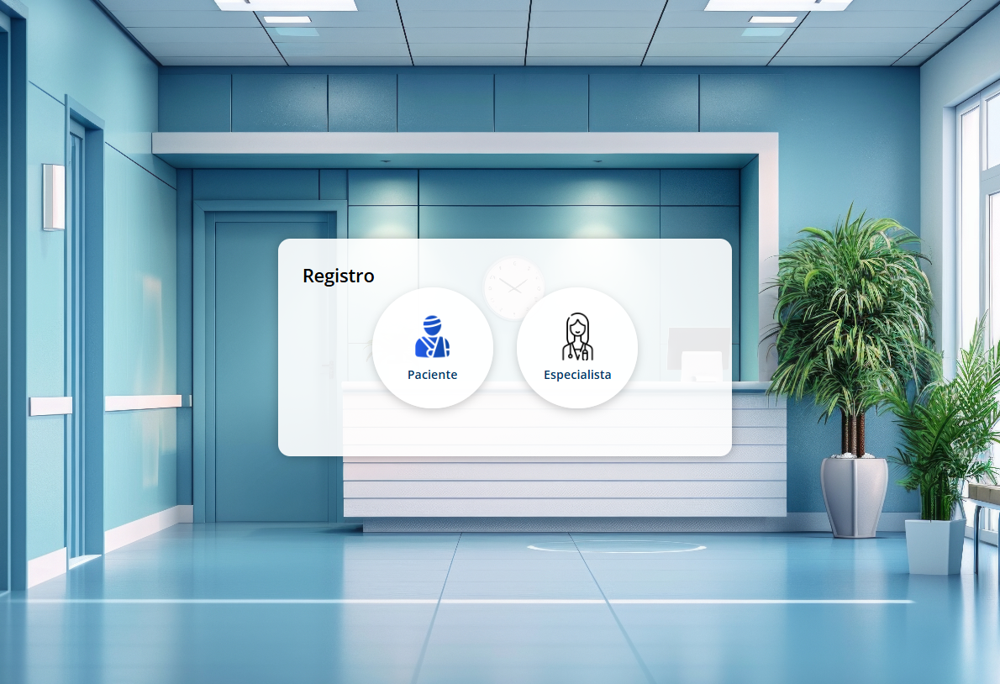
Esta pantalla permite a un usuario darse de alta en la plataforma.
Mediante ella pueden darse de alta Pacientes y Especialistas. 
Los usuarios Admin requieren de un procedimiento especial. 

### Pantalla de login
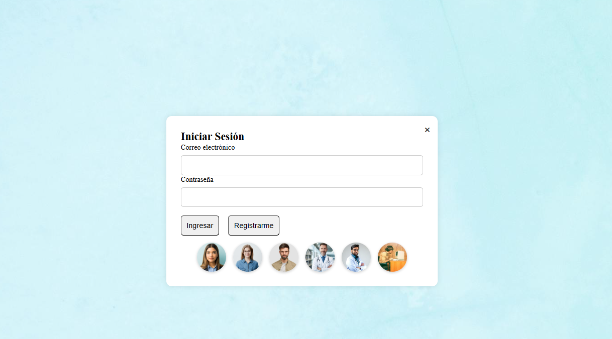
Esta pantalla permite a los usuarios ingresar con su correo y contraseña. Si el email no está confirmado (pacientes) o siendo especialista su email no está habilitado por un admin, se muestra un mensaje de advertencia.

### Pantalla de home de pacientes
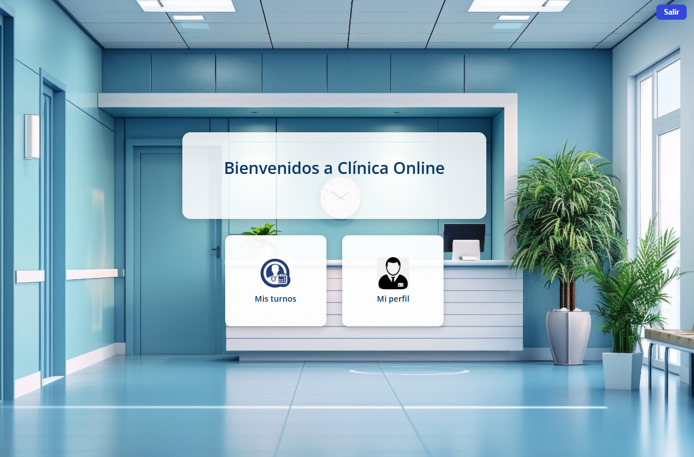
Esta es la vista de la pagina principal una vez que ha ingresado 
con un usuario con perfil de paciente. 

### Pantalla de home de especialistas
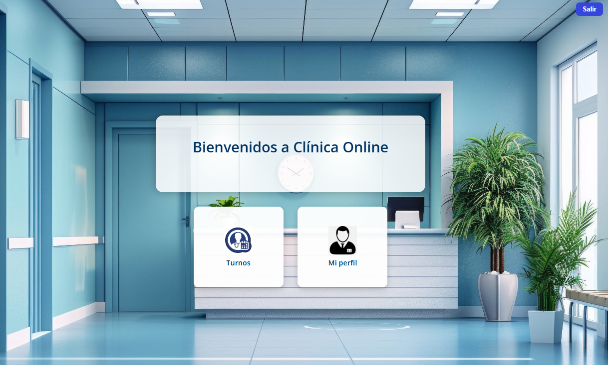
Esta es la vista de la pagina principal una vez que ha ingresado 
con un usuario con perfil de especialista.  

### Pantalla de home del administrador
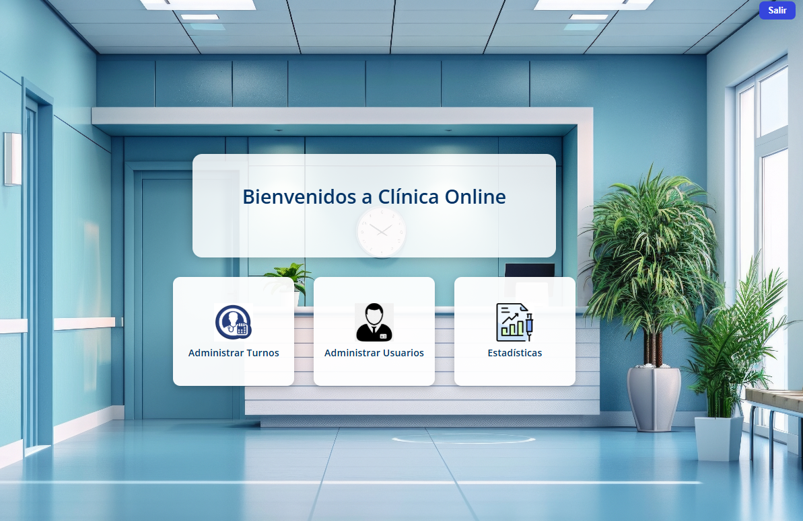
Esta es la vista de la pagina principal una vez que ha ingresado 
con un usuario con perfil admin. 

---
### 📋 Gestión de turnos 
Los turnos pueden ser gestionados por cualquiera de los tres
perfiles de usuario pero con funcionalidades distintas. 

#### Para pacientes:
- Solicitud de turnos filtrando por especialidad y profesional.

Los pacientes pueden dar de alta un turno, cancelarlo, 
o dar su opinion sobre la atención de un especialista. 
Para dar de alta un turno deben seleccionar, la especialidad
el especialista y finalmente dia y hora de la atencion, tal 
como se muestra en la imagen. 

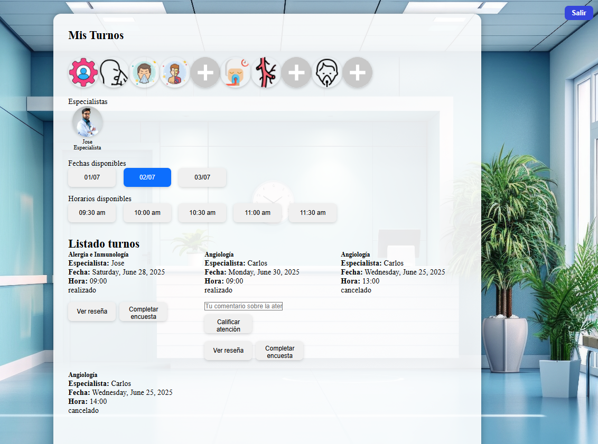

Los pacientes tambien tienen la opción de consultar las
atenciones que han tenido con un especialista desde la opcion
"Mi perfil", en la cual pueden además acceder a su historia clínica
e imprimir el reporte de los turnos. 

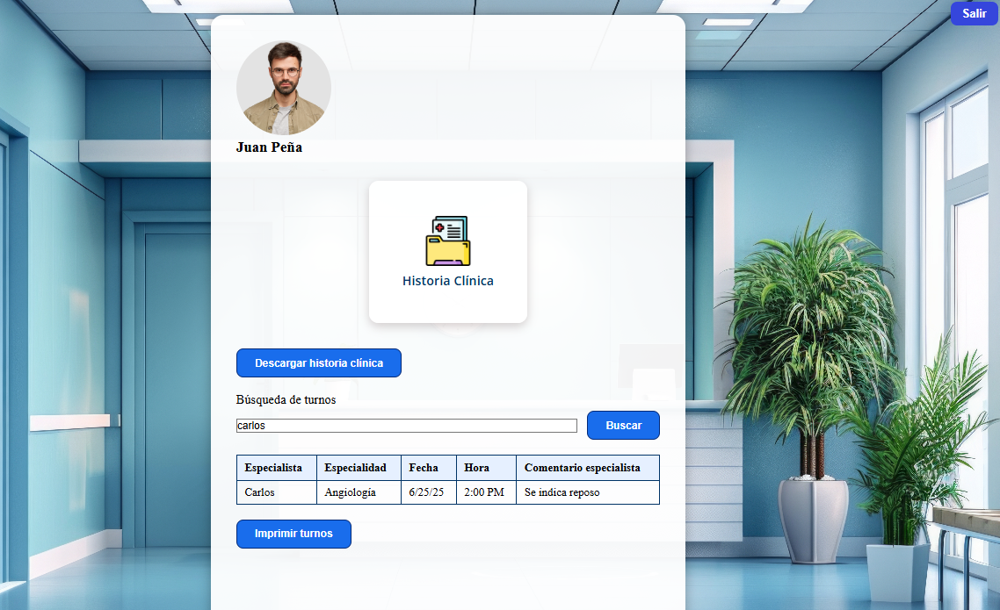

#### Para especialistas:
- Aceptación, rechazo, finalización de turnos.

Por su parte los especialistas pueden Aceptar un turno o rechazarlo
y deben siempre darlo por finalizado despues de haber atendido al paciente. 
Antes de finalizar un turno se le pedira al especialista que complete
la historia clinica del paciente. 

Adicionalmente un Especialista puede consultar las reseñas que ha 
dejado en un turno haciendo click en el botón correspondiente. 

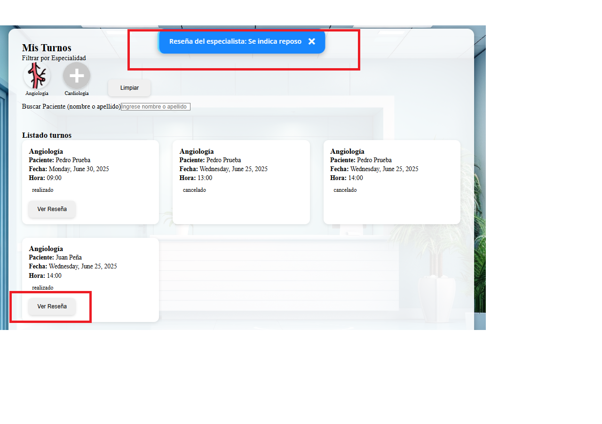

#### Para administradores:
- Visualización de todos los turnos por paciente y especialista.

Un usuario con el rol de Administrador podrá tambien consultar y dar 
turnos de alta previa selección del paciente, al que se desea asignar el turno, el resto del la operatoria es igual que para el paciente. 

---
### 👥 Gestión de usuarios (solo para administradores)

- Alta de nuevos usuarios.

Un usuario con rol de Administrador puede dar de alta cualquier
tipo de usuarios, incluyendo otros Administradores. Para esto cuenta
con el modulo de Administración de Usuarios. AdministrarUsuarios

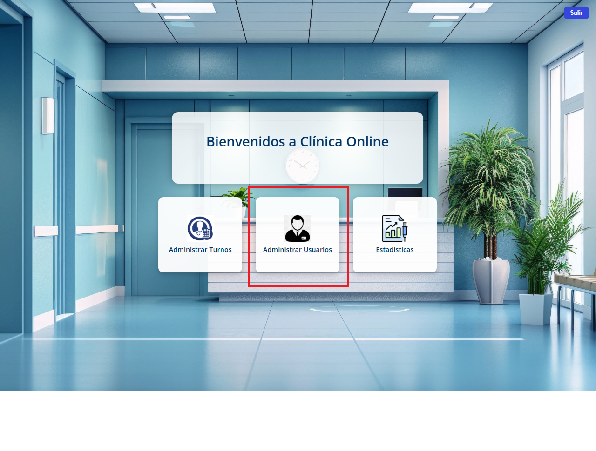

Para ello deberá completar el formulario correspondiente. formAltaUsuarioAdmin

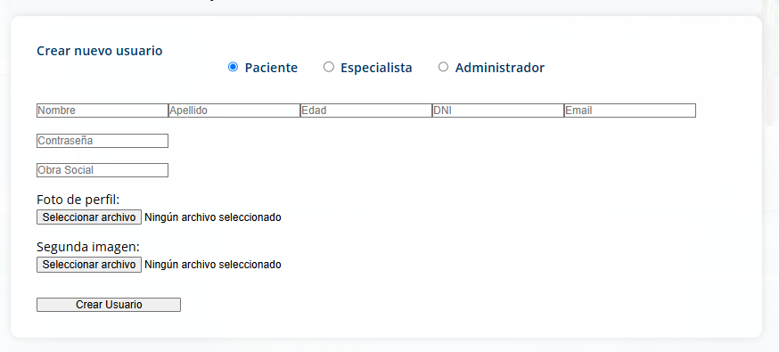

- Descarga de reportes en Excel.

Si asi lo requiere, el usuario Administrador tambien puede descargar
la información de los usuarios en un archivo excel

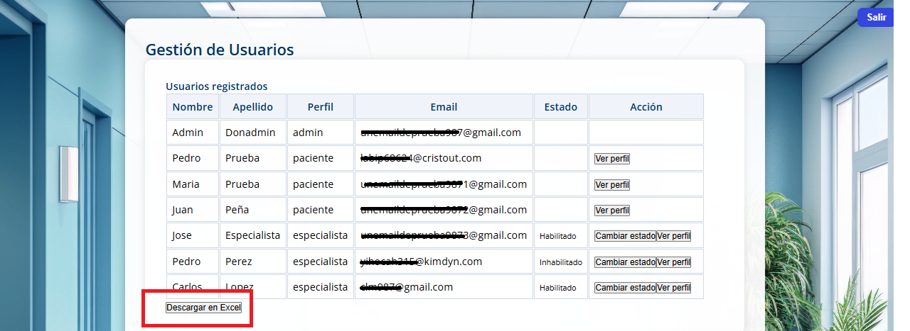

- Habilitación de especialistas y consulta de perfiles.

En esta misma sección el usuario Administrador podrá habilitar a aquellos
especialistas que se han dado de alta en el sistema y tambien podrá acceder al
perfil de los pacientes para consultar los turnos y la historia medica de estos. 

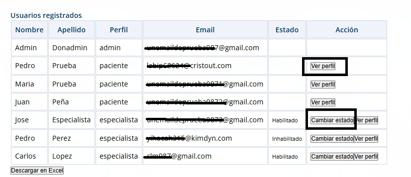

Finalmente, el usuario Admin tambien cuenta con un acceso directo a generar
un archivo pdf con el listado de turnos de los pacientes del sistema, con 
solo hacer click en la foto de perfil de este en la seccion "Imprimir turnos"

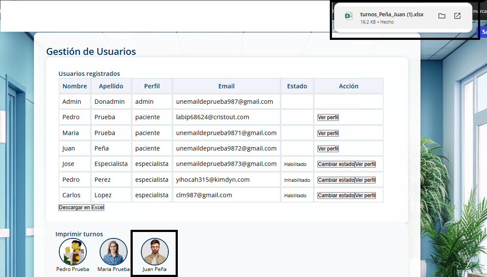

---
### 📊 Estadísticas del sistema

Una sección importante con la que cuenta el usuario administrador
es la que le permite descargar información estadística relevante del sistema. 
Para acceder a esta información empleará el modulo "Estadísticas".

 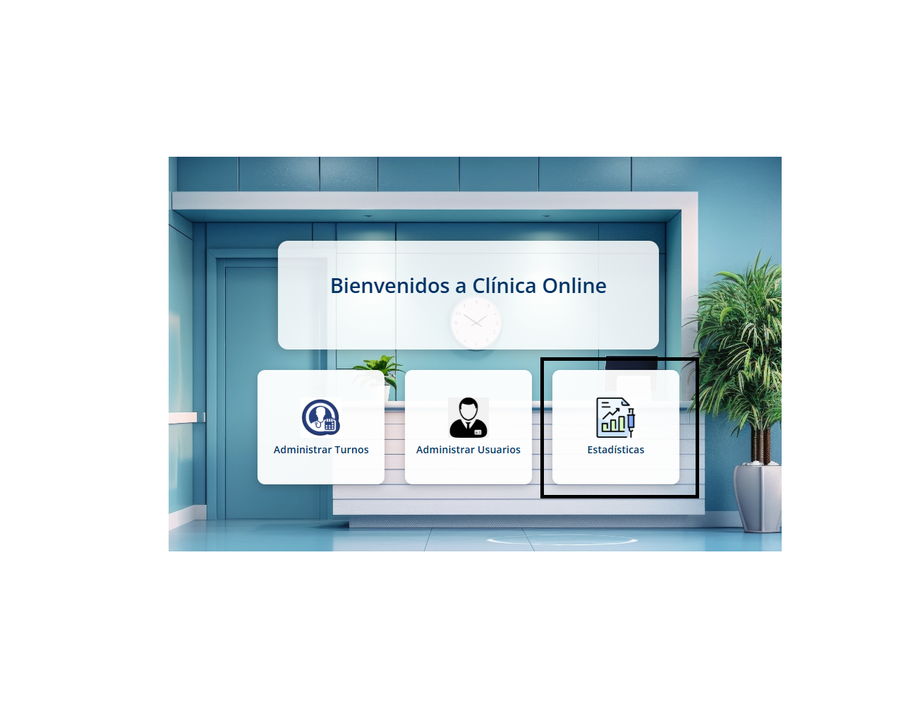

El modulo incluye gráficos sobre:

- Log de Accesos por usuario que puede ser exportado en excel.

 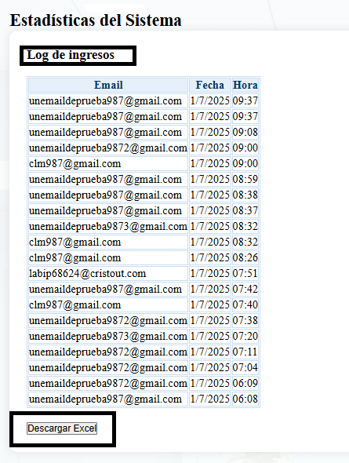

- Variada información gráfica que puede ser descargada en un reporte
automático en PDF con logo Institucional. 
- Cantidad de turnos por día
- Turnos tomados por especialidad
- Turnos tomados por estados de turno 

 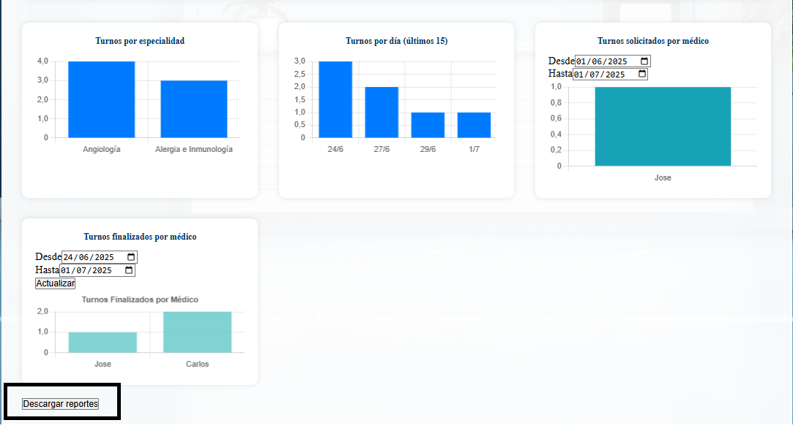

 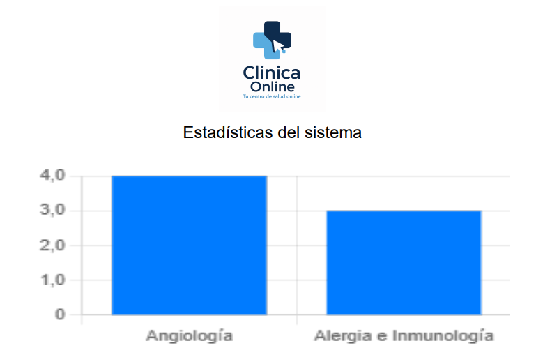
---

## ⚙️ Tecnologías utilizadas

- **Frontend:** Angular (standalone components)
- **Estilos:** Bootstrap 5
- **Backend:** Supabase (auth + database + storage)
- **Hosting:** Firebase

---